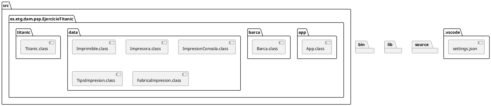
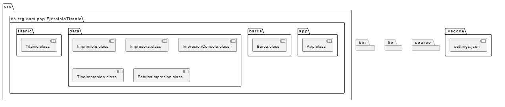
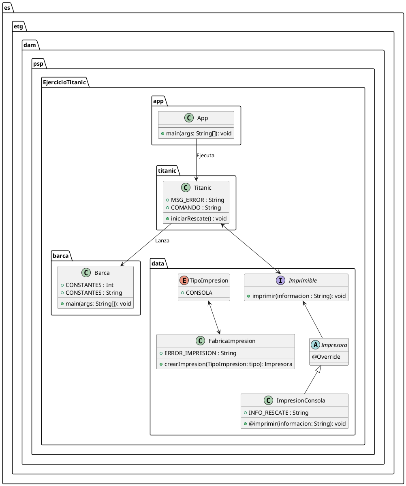
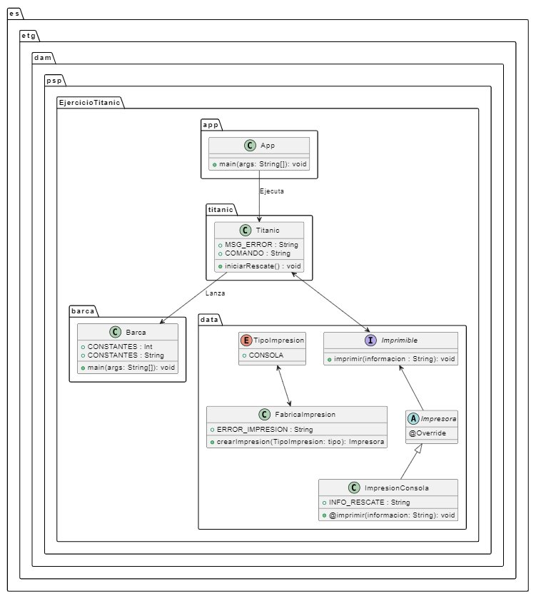

# Ejercicio Titanic

## Análisis

### Descripción del Problema 

El proyecto simula un rescate en el Titanic, donde varias barcas están evacuando supervivientes y se registran detalles de este proceso en la consola.
Para ello, el sistema utiliza un enfoque de paralelismo y ejecución de procesos en Java, así como una arquitectura extensible que permite la impresión de la información en diferentes formatos (actualmente solo en consola, pero con posibilidad de expansión a otros métodos de impresión en el futuro).

### Objetivos del Sistema 

Lanzar varios procesos que simulan el rescate de supervivientes desde el Titanic.

**`Modularidad y Expansión`**: Crear un sistema fácilmente ampliable que permita cambiar el método de impresión de los resultados sin alterar la lógica de rescate.

#### Método:

1. **`App`**: Clase principal que inicia el programa llamando a la clase Titanic.

2. **`Titanic`**: Esta clase controla el proceso principal del rescate.
Se encarga de lanzar un proceso externo (Barca) que simula el rescate de supervivientes y gestiona la captura de la salida de este proceso para su posterior impresión.

3. **`Barca`**: Esta clase simula la evacuación de supervivientes en varias barcas.
Cada barca se lanza con un número aleatorio de supervivientes y un tiempo de espera entre barcas, representando un proceso paralelo al rescate.

4. **`TipoImpresion (Enum)`**: Enum que representa los distintos tipos de impresión posibles en el sistema, actualmente solo CONSOLA.

5. **`Imprimible (Interfaz)`**: Interfaz que define el método imprimir para cualquier clase que implemente un método de impresión de información.

6. **`Impresora`**: Clase base abstracta que implementa Imprimible. Todas las clases de impresión extenderán esta clase.

7. **`ImpresionConsola`**: Clase que implementa la impresión en consola de los resultados del rescate.

8. **`FabricaImpresion`**: Agrupa las clases relacionadas con los distintos tipos de impresión (TipoImpresion, Imprimible, Impresora, ImpresionConsola, FabricaImpresion).

## Diseño

### Paquetería





### Clases





## Ejecución/Código

Para poder ejecutar el programa nos tendremos que posicionar sobre la carpeta src y lanzar la ejecución de la clase App, sigue estos pasos ejecutando los comandos desde la terminal:

```bash
cd src

java es/etg/dam/psp/EjercicioTitanic/app/App

# En caso de necesitar compilar las clases se precisa ejecutar el siguiente comando:

javac es/etg/dam/psp/EjercicioTitanic/app/*.java es/etg/dam/psp/EjercicioTitanic/barca/*.java es/etg/dam/psp/EjercicioTitanic/data/*.java es/etg/dam/psp/EjercicioTitanic/titanic/*.java
```

## Pruebas

Se ha probado que el sistema ejecuta correctamente la simulación del rescate al invocar el método iniciarRescate() en la clase Titanic, lo que activa el proceso de rescate con la generación de supervivientes aleatorios para cada barca. 

Se ha comprobado que el número de supervivientes por barca es aleatorio y se encuentra dentro del rango esperado, variando entre diferentes ejecuciones. 
Además, se ha validado que la información generada se imprime adecuadamente en la consola, comenzando con el mensaje de encabezado y mostrando los resultados de cada barca y el total de supervivientes. 

Se ha verificado que las excepciones se manejan de manera correcta, mostrando un mensaje de error apropiado si se produce algún fallo durante el proceso.